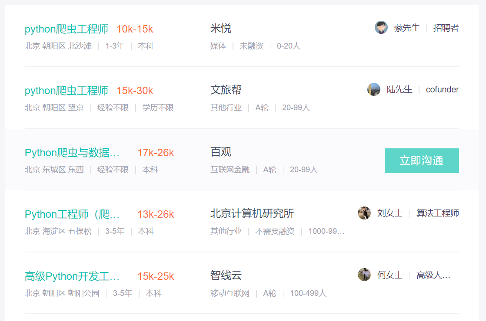

# 一、网络爬虫
#### 1、定义
网络爬虫（又被称为网页蜘蛛，网络机器人，在FOAF社区中间，更经常的称为网页追逐者），是一种按照一定的规则，自动地抓取万维网信息的程序或者脚本。另外一些不常使用的名字还有蚂蚁、自动索引、模拟程序或者蠕虫。
#### 2、分类
通用爬虫 聚焦爬虫
#### 3、薪资待遇


# 二、安装软件
>链接：https://pan.baidu.com/s/1I-J7b7OZV8fSdOYBf55ToQ 
提取码：j0xr
- [python](https://www.python.org/downloads/)
- [pyCharm](https://www.cnblogs.com/horns/p/10699949.html)
- Twisted网络引擎框架
- chrome扩展 [XPath Helper](./chrome_xpath.md) 

三、Scrapy
Scrapy，Python开发的一个快速、高层次的屏幕抓取和web抓取框架，用于抓取web站点并从页面中提取结构化的数据。Scrapy用途广泛，可以用于数据挖掘、监测和自动化测试。  
Scrapy吸引人的地方在于它是一个框架，任何人都可以根据需求方便的修改。它也提供了多种类型爬虫的基类，如BaseSpider、sitemap爬虫等，最新版本又提供了web2.0爬虫的支持。
#### 1、目录结构
```python
 uekspider     项目文件
    |-spiders  爬虫
        |-__init__.py  （忽略）
        |-a185666.py  爬虫文件
        |- ...  其他爬虫文件
    |-items.py 爬取数据字段，类似数据库字段
    |-middlewares.py  中间件模块（忽略）
    |-pipelines.py    管道文件 （忽略）
    |-settings.py     爬虫设置文件
 |- README.md
 |-scrapy.cfg  Scrapy设置文件（忽略）
```
#### 2、入门教程
###### （1）windows安装
>(1) 下载Twisted，Scrapy 依赖Twisted。Twisted是用Python实现的基于事件驱动的网络引擎框架 [点击下载](https://www.lfd.uci.edu/~gohlke/pythonlibs/) 下载请确认本地python版本  
(2)执行语句 **pip install Twisted-18.9.0-cp37-cp37m-win32.whl**  进行Twisted安装  
(3)安装scrapy pip install scrapy

##### （2）创建scrapy项目
```python
scrapy startproject 项目名
```
##### （3）创建爬虫文件
```python
scrapy genspider 爬虫名字(名字我使用的是id表示)  站点地址如(baidu.com)
```
运行完程序，项目spiders\文件夹中会出现一个爬虫文件  
```python
import scrapy

class DmozSpider(scrapy.Spider):
    name = "dmoz"   # 爬虫名
    allowed_domains = ["dmoz.org"]  # 站点名
    start_urls = [
        "http://www.dmoz.org/Computers/Programming/Languages/Python/Books/",
    ]  # 爬虫第一次爬取页面地址

    def parse(self, response): # 运行爬虫要执行的文件
        filename = response.url.split("/")[-2]
        with open(filename, 'wb') as f:
            f.write(response.body)

```
##### （4）运行爬虫
```python
scrapy crawl 爬虫名字
```

##### 5、项目中可能用到的response对象方法
>xpath()
```python
def parse(self,response): 
    # （1）获取元素对象方法
    res1 = response.xpath("xpath语法")
    # （2）获取元素内容方法
    res2 = response.xpath("xpath语法").extract() 
    # （3）获取元素对象并通过正则进行匹配内容，返回元素内容
    res3 = response.xpath("xpath语法").re("正则语法")
    # 一般我们测试时只获取元素内容，常用（2）（3）
    print(res1,res2,res3) #输出内容检查是否能够获取
```
# 四、python
#### 1、解释器的下载与安装
[安装详情请点击](./python安装.md)
#### 2、python概述
python是增长最快的主流编程语言  
Python是一种解释型脚本语言，可以应用于以下领域：
- Web 和 Internet开发
- 科学计算和统计
- 教育
- 桌面界面开发
- 软件开发
- 后端开发
#### 3、python基础

# 五、xpath
通过路径的方式获取页面元素
#### 一、[xpath入门](http://www.w3school.com.cn/xpath/index.asp)
- // 从当前节点选取后代节点（任意位置）
- // NodeName  获取页面中所有元素节点
- /  从当前节点获取元素
- .  当前节点
- .. 当前节点
- @选择属性
  - /@href 从当前节点获取href属性
  - /@* 获取元素全部属性
  - tag[@attribute='value'] 获取attribute=value的值
- [tag] 选择所有具有特定元素的节点
  - //div/ul/li[div] div子元素中ul子元素li(拥有div子元素的)

# 六、项目要求
#### 1、表格字段描述
-|-|-|id|column|url|page_num|tail_url|header_url|tail_url|detail_head_url|detail_tail_url|detail_xpath|detail_re|detail_url_xpath|detail_url_re|title_xpath|title_re|content_xpath|content_re|time_xpath|time_re|time_in_list|title_in_list|page_start_num|post_data|post_data_re|
---|---|---|---|---|---|---|---|---|---|---|---|---|---|---|---|---|---|---|---|---|---|---|---|---|---|---
审核人|负责人|备注|*标识符*|*标题*|*网址*|*总页数*|-(不填)|列表网址（变化值前全部地址不包含变化值的部分）|列表网址（变化值之后的、不包含变化值的部分）|文章内容页的网址（变化值前地址，不包含变化值）|文章内容页的网址（变化值之后的网址，不包括变化值）|父元素xpath|父元素正则|内容页url的xpath|内容页url的正则|文章标题的xpath|文章标题的正则|文章内容的xpath|文章内容的正则|文章时间的xpath|文章时间的正则|文章时间是否在列表页（0/1）|标题是否在列表页（0/1）|列表页面开始页码|post参数键值对（post方式formData值，变化的Value用%s代替）|post变化值正则(除页码以外的所有数据的key和value)|
 杨登辉|杨俊林|get方式请求|*46240*|*农村产权交易-成交公示*|*http://58.216.247.121:8086/ggzy/jyxx/001004/001004004/about.html*|32|-|http://58.216.247.121:8086/ggzy/jyxx/001004/001004004/|.html|-|-|-|-|-|-|-|-|-|-|-|-|-|-|-|-|-
杨登辉 |贾桂超|post方式请求|23062|扬州工程建设信息网|http://www.yzcetc.com/yzcetc/YW_Info/ZiGeYS/MoreYSList.aspx?CategoryNum=003|-|-|-|-|-|-|-|-|-|-|-|-|-|-|-|-|-|-|-|-|-|

#### 2、情景分析解决
1. column与url不对应，需根据column更改url

# 七、分组名单
组名|1|2|3|4|5|6|7|8
---|---|---|---|---|---|---|---|---
组长| | | | | | | |
组员|杨俊林|靳志龙|陈艳伟|韩钟涛|张斌|贾桂超|牛晓鑫 李彦榕|王莎莎|
 